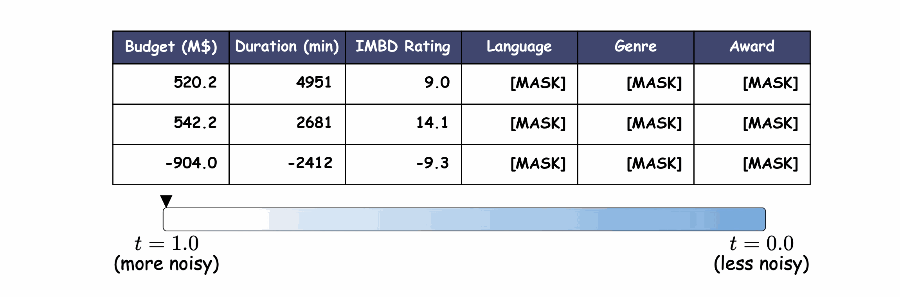
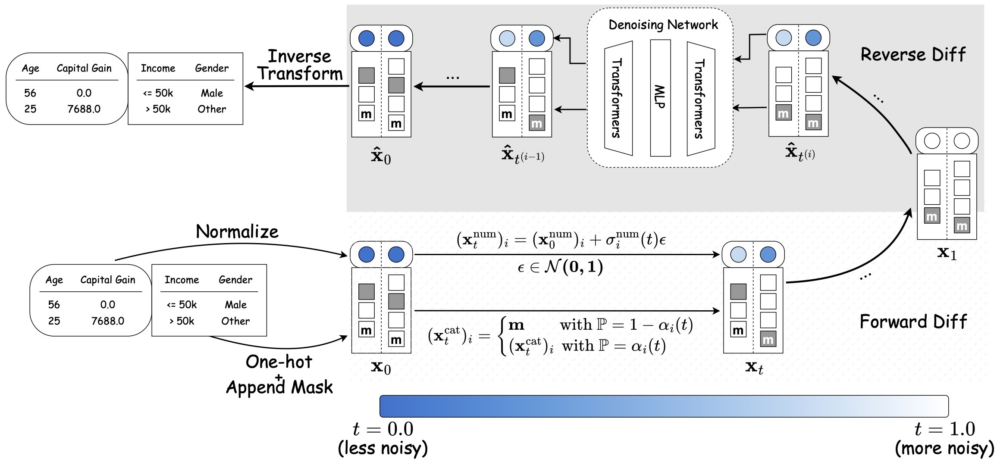

# TabDiff: a Mixed-type Diffusion Model for Tabular Data Generation

<p align="center">
  <a href="https://github.com/MinkaiXu/TabDiff/blob/main/LICENSE">
    
  </a>
  <a href="https://openreview.net/forum?id=swvURjrt8z">
    
  </a>
  <a href="https://arxiv.org/abs/2410.20626">
    
  </a>
</p>

<div align="center">
  
  <p><em>Figure 1: Visualing the generative process of TabDiff. A high-quality version of this video can be found at <a href="images/tabdiff_demo.mp4" download>tabdiff_demo.mp4</a></em></p>
</div>

This repository provides the official implementation of TabDiff: a Mixed-type Diffusion Model for Tabular Data Generation (ICLR 2025).

## Latest Update
- [2025.04]：The categorical-heavy dataset **[Diabetes](https://archive.ics.uci.edu/dataset/296/diabetes+130-us+hospitals+for+years+1999-2008)** evaluated in the paper has now been released!
- [2025.02]：Our code is finally released! We have released part of the tested datasets. The rest will be released soon!

## Introduction

<div align="center">
  
  <p><em>Figure 2: The high-level schema of TabDiff</a></em></p>
</div>
TabDiff is a unified diffusion framework designed to model all muti-modal distributions of tabular data in a single model. Its key innovations include:  

1) Framing the joint diffusion process in continuous time,
2) A feature-wised learnable diffusion process that offsets the heterogeneity across different feature distributions,
3) Classifier-free guidance conditional generation for missing column value imputation. 

The schema of TabDiff is presented in the figure above. For more details, please refer to [our paper](https://arxiv.org/abs/2410.20626).


## Environment Setup

Create the main environment with [tabdiff.yaml](tabdiff.yaml). This environment will be used for all tasks except for the evaluation of additional data fidelity metrics (i.e., $\alpha$-precision and $\beta$-recall scores)

```
conda env create -f tabdiff.yaml
```

Create another environment with [synthcity.yaml](synthcity.yaml) to evaluate additional data fidelity metrics

```
conda env create -f synthcity.yaml
```

## Datasets Preparation

### Using the datasets experimented in the paper

Download raw datasets:

```
python download_dataset.py
```

Process datasets:

```
python process_dataset.py
```

### Using your own dataset

First, create a directory for your dataset in [./data](./data):
```
cd data
mkdir <NAME_OF_YOUR_DATASET>
```

Compile your raw tabular data in .csv format. **The first row should be the header** indicating the name of each column, and the remaining rows are records. After finishing these steps, place you data's csv file in the directory you just created and name it as <NAME_OF_YOUR_DATASET>.csv. 

Then, create <NAME_OF_YOUR_DATASET>.json in [./data/Info](./data/Info). Write this file with the metadata of your dataset, covering the following information:
```
{
    "name": "<NAME_OF_YOUR_DATASET>",
    "task_type": "[NAME_OF_TASK]", # binclass or regression
    "header": "infer",
    "column_names": null,
    "num_col_idx": [LIST],  # list of indices of numerical columns
    "cat_col_idx": [LIST],  # list of indices of categorical columns
    "target_col_idx": [list], # list of indices of the target columns (for MLE)
    "file_type": "csv",
    "data_path": "data/<NAME_OF_YOUR_DATASET>/<NAME_OF_YOUR_DATASET>.csv"
    "test_path": null,
}
```

### Important Notes When Creating the Info File
- The MLE evaluation and the imputation task (see later sections for details) assume that one column of your data is the regression or classification target. To enable these tasks, you will need to specify `target_col_idx`. If you don't need to evalute MLE, you can comment out the following line: https://github.com/MinkaiXu/TabDiff/blob/0c4fc3bbfa19046d36c5dce64628df52d5c73d15/tabdiff/main.py#L152
- The fields `target_col_idx`, `num_col_idx` and `cat_col_idx` must be multually exclusive—no column should appear in more than one of these lists. 
- Set the task_type to "regression" if the target column is numerical, or "binclass" if it is categorical.

Finally, run the following command to process your dataset:
```
python process_dataset.py --dataname <NAME_OF_YOUR_DATASET>
```

## Training TabDiff

To train an unconditional TabDiff model across the entire table, run

```
python main.py --dataname <NAME_OF_DATASET> --mode train
```

Current Options of ```<NAME_OF_DATASET>``` are: adult, default, shoppers, magic, beijing, news

Wanb logging is enabled by default. To disable it and log locally, add the ```--no_wandb``` flag.

To disable the learnable noise schedules, add the ```--non_learnable_schedule```. Please note that in order for the code to test/sample from such model properly, you need to add this flag for all commands below.

To specify your own experiment name, which will be used for logging and saving files, add ```--exp_name <your experiment name>```. This flag overwrites the default experiment name (learnable_schedule/non_learnable_schedule), so, similar to ```--non_learnable_schedule```, once added to training, you need to add it to all following commands as well.

## Sampling and Evaluating TabDiff (Density, MLE, C2ST)

To sample synthetic tables from trained TabDiff models and evaluate them, run
```
python main.py --dataname <NAME_OF_DATASET> --mode test --report --no_wandb
```

This will sample 20 synthetic tables randomly. Meanwhile, it will evaluate the density, mle, and c2st scores for each sample and report their average and standard deviation. The results will be printed out in the terminal, and the samples and detailed evaluation results will be placed in ./eval/report_runs/<EXP_NAME>/<NAME_OF_DATASET>/.

## Evaluating on Additional Fidelity Metrics ($\alpha$-precision and $\beta$-recall scores)
To evaluate TabDiff on the additional fidelity metrics ($\alpha$-precision and $\beta$-recall scores), you need to first make sure that you have already generated some samples by the previous commands. Then, you need to switch to the `synthcity` environment (as the synthcity packet used to compute those metrics conflicts with the main environment), by running
```
conda activate synthcity
```
Then, evaluate the metrics by running
```
python eval/eval_quality.py --dataname <NAME_OF_DATASET>
```

Similarly, the results will be printed out in the terminal and added to ./eval/report_runs/<EXP_NAME>/<NAME_OF_DATASET>/

## Evaluating Data Privacy (DCR score)
To evalute the privacy metric DCR score, you first need to retrain all the models, as the metric requires an equal split between the training and testing data (our initial splits employ a 90/10 ratio). To retrain with an equal split, run the training command but append `_dcr` to ```<NAME_OF_DATASET>```
```
python main.py --dataname <NAME_OF_DATASET>_dcr --mode train
```

Then, test the models on DCR with the same `_dcr` suffix
```
python main.py --dataname <NAME_OF_DATASET>_dcr --mode test --report --no_wandb
```


## Missing Value Imputation with Classifier-free Guidance (CFG)
Our current experiments only include imputing the target column. However, our implementation, located at ```sample_impute()``` in [unified_ctime_diffusion.py](./tabdiff/models/unified_ctime_diffusion.py), should support imputing multiple columns with different data types.

### Training Guidance Model
In order to enable classifier-free guidance (CFG), you need to first train an unconditional guidance model on the target column by running the training command with the `--y_only` flag
```
python main.py --dataname <NAME_OF_DATASET> --mode train --y_only
```

### Sampling Imputed Tables
With the trained guidance model, you can then impute the missing target column by running the testing command with the `--impute` flag
```
python main.py --dataname <NAME_OF_DATASET> --mode test --impute --no_wandb
```
This will, by default, randomly produce 50 imputed tables and save them to ./impute/<NAME_OF_DATASET>/<EXP_NAME>.

### Evaluating Imputation
You can then evaluate the imputation quality by running
```
python eval_impute.py --dataname <NAME_OF_DATASET>
```

## Separate numerical-score and categorical-h verification

This experimental path freezes a trained TabDiff model and starts with one
broad fixed numerical box. For binary active-column vector `a`, the eventual
partial-query terminal event is

```
B_a = intersection over j with a_j=1 of {lower_j <= X_0j <= upper_j}.
h(t, x, a) = P(X_0 in B_a | X_t=x).
delta_D(t, x, a) = sigma(t)^2 * grad_x log h(t, x, a).
```

The mask-conditioned stage uses two
separately parameterized lightweight FT-periodic guides with identical
architectures. Both see the complete noisy numerical and categorical state,
time, and the binary active-column vector `a`. The numerical guide directly predicts
`sigma(t)^2 * grad_x log h` and is regressed against
`x_0 - D_base(x_t,t)`. The categorical guide predicts scalar `log h`; frozen
base token probabilities are multiplied by candidate-state `h(child)` values
and normalized separately over each column's real categories. The unchanged
current state is not evaluated: its `log h` is the per-column log normalizer
from the harmonic identity. The resulting generator is passed to TabDiff's
original `_absorbed_closs` against the same conditional endpoint. The networks
do not share parameters. No negative examples, BCE classifier, or validation
split are used. Guidance strength is fixed to 1.

Each optimizer step samples one mask shared by its complete batch: 80% use
independent Bernoulli(0.5) entries, 10% force every interval active, and 10%
force every interval inactive. It finds all training rows satisfying exactly
the active intervals and draws the endpoint batch uniformly with replacement.
The all-inactive anchor therefore uses the full dataset and teaches the guides
to recover the unconditional model.

For optional categorical equality constraints, the sampler also implements the
Section 4 ordering construction. If categorical columns `C` are fixed, it draws
each trajectory's reverse start time from the discretized posterior
`q_C(t)` for paths on which every column in `C` is revealed before every free
categorical column. It starts with `C` fixed and all other categorical entries
masked. The guide is still trained on the original forward-corruption law
`q(x_t | x_0)`: `q_C(t)` changes sampling initialization and is not a new
guide-training distribution. With the present numerical-only query there are no
fixed categorical entries, so `q_C` is undefined and the sampler correctly
falls back to the original `t=1` start. During each categorical reverse step,
the sampler normalizes `p_base(k|x_t) * h(child_k)` across real categories
before calling TabDiff's original MDLM update. Thus the guide changes which
category is revealed while the original mask-persistence and reveal timing are
left unchanged.

Generate and inspect the deterministic intervals first:

```bash
mkdir -p logs
INTERVAL_JOB=$(sbatch --parsable doob_h_intervals.sh)
echo "interval job: ${INTERVAL_JOB}"
```

After that job finishes, inspect and version the fixed query:

```bash
cat constraints/shoppers/fixed_numerical_intervals.json
```

Train the two mask-conditioned FT-periodic guides:

```bash
TRAIN_JOB=$(sbatch --parsable --array=0 doob_h_train.sh)
```

Then sample a random test-time mask:

```bash
SAMPLE_JOB=$(sbatch --parsable --array=0 \
  --dependency="afterok:${TRAIN_JOB}" doob_h_sample.sh)
```

Each CSV gets a sibling `.query.json` containing only the active constraints.
The default output is
`conditional_samples/shoppers/ft_periodic_seed0_partial_masks.csv`.

Evaluate the existing generated table without resampling:

```bash
sbatch --array=0 --dependency="afterok:${SAMPLE_JOB}" doob_h_evaluate.sh
```

Training runs for 6000 optimizer steps by default, with a batch of 1024
uniformly sampled conditional endpoints per step. The same forward-noised batch
supplies both the Section 5 numerical target and TabDiff categorical loss. EMA
updates both guides after every step; the fixed all-active diagnostic runs every
100 steps. Override these with, for example,
`sbatch --array=0 --export=ALL,EPOCHS=2000,BATCH_SIZE=512,DIAGNOSTIC_EVERY=100 doob_h_train.sh`.

The dataset and checkpoint-directory names can also be overridden without
editing the scripts, for example
`sbatch --export=ALL,DATANAME=shoppers,FT_MODEL=ft_periodic_small_d64_L4_seed0 doob_h_train.sh`.

The sampler uses guidance strength 1.0 and writes both the generated CSV and a
`.constraints.json` report with raw and normalized-space joint and per-column
hit rates. `joint_hit_rate` is evaluated on the final inverse-transformed table
in raw units; the normalized rate is retained as a diagnostic because quantile
normalization is not one-to-one for repeated values. A 100% raw joint hit rate
means every generated numerical row satisfied every saved user-facing interval.
The default per-coordinate correction clamp is 5 normalized units and can be
changed with `--max-correction`.

Existing conditional CSVs can be diagnosed and evaluated without sampling
again. The CPU-only evaluation array recomputes raw-space constraint hit rates,
then uses TabDiff's SDMetrics Shape and Trend implementation for an
apples-to-apples comparison: conditional generation and matching unconditional
generation are each evaluated against the same real rows satisfying the raw
constraint. The auxiliary SDMetrics validity/structure report is disabled for
this path.

The script first checks the standard training-result path
`tabdiff/result/<dataset>/<model>/8000/samples.csv`, then the two report paths
for `all_samples/samples_0.csv`. Override the epoch with
`UNCONDITIONAL_EPOCH`, or provide a different matching unconditional table:

```bash
sbatch --export=ALL,UNCONDITIONAL_SAMPLES=/path/to/unconditional_samples.csv \
  doob_h_evaluate.sh
```

Results are written under
`evaluations/shoppers/<MODEL_NAME>_all_two_guides/density_results.json`, while SLURM
stdout and stderr are written under `evaluations/slurm/`; the detailed
per-column Shape and column-pair Trend tables are saved beside it.

### HARPOON baseline

The official [HARPOON repository](https://github.com/adis98/Harpoon) is pinned
as `baselines/harpoon` at commit `40dc8cee26e215e86523045fdafb7c1ad89c3fd7`.
This is a Shoppers-only, paper-aligned baseline. It does not use the learned
Doob guide, active-mask parameterization, categorical `h` ratios, or posterior
start logic. It trains HARPOON's unconditional OHE DDPM and applies Algorithm 1
only at test time.

For dirty estimate `x0_hat = Q_t(x_t)`, Appendix D Eq. 9 and Appendix G.2 give

```
L_inf = ||ReLU(lower - x0_hat)||_2 + ||ReLU(x0_hat - upper)||_2.
g_t = grad_x_t L_inf(Q_t(x_t), c).
x_{t-1} = DDPM_step(x_t) - eta * g_t.
```

The default exactly uses the paper's Shoppers range task,
`Administrative >= 4`, with `T=200`, `eta=0.2`, batch size 1024, 1000 epochs,
and the paper's linear beta schedule. The stochastic reverse term uses the
standard DDPM posterior standard deviation. By default, the generated sample
count equals the number of Shoppers test rows satisfying the inequality, as in
the paper; set `NUM_SAMPLES=1000` to override this for a fixed-size comparison.

After cloning this repository, fetch the pinned baseline once:

```bash
git submodule update --init --recursive
mkdir -p harpoon_logs evaluations/slurm
```

Train the Shoppers unconditional HARPOON backbone:

```bash
HARPOON_TRAIN=$(sbatch --parsable harpoon_train.sh)
```

Generate the paper's guided range samples and a matching unconditional table:

```bash
HARPOON_COND=$(sbatch --parsable --dependency="afterok:${HARPOON_TRAIN}" \
  harpoon_sample.sh)
HARPOON_UNCOND=$(sbatch --parsable --dependency="afterok:${HARPOON_TRAIN}" \
  --export=ALL,GUIDANCE_SCALE=0,OUTPUT=conditional_samples/shoppers/harpoon_unconditional.csv \
  harpoon_sample.sh)
```

Constraints are supplied only at inference and can change without retraining.
For example, this is a new conjunction:

```bash
export LOWER_BOUNDS="Administrative=5,PageValues=10"
export UPPER_BOUNDS="BounceRates=0.04"
sbatch --export=ALL,OUTPUT=conditional_samples/shoppers/harpoon_new_query.csv \
  harpoon_sample.sh
```

Evaluate the paper task against Shoppers test rows satisfying
`Administrative >= 4`:

```bash
sbatch --dependency="afterok:${HARPOON_COND}:${HARPOON_UNCOND}" \
  harpoon_evaluate.sh
```

## License

This work is licensed undeer the MIT License.

## Acknowledgement
This repo is built upon the previous work TabSyn's [[codebase]](https://github.com/amazon-science/tabsyn). Many thanks to Hengrui!

## Citation
Please consider citing our work if you find it helpful in your research!
```
@inproceedings{
shi2025tabdiff,
title={TabDiff: a Mixed-type Diffusion Model for Tabular Data Generation},
author={Juntong Shi and Minkai Xu and Harper Hua and Hengrui Zhang and Stefano Ermon and Jure Leskovec},
booktitle={The Thirteenth International Conference on Learning Representations},
year={2025},
url={https://openreview.net/forum?id=swvURjrt8z}
}
```
## Contact
If you encounter any problem, please file an issue on this GitHub repo.

If you have any question regarding the paper, please contact Minkai at [minkai@stanford.edu](minkai@stanford.edu) or Juntong at [shisteve@usc.edu](shisteve@usc.edu).
